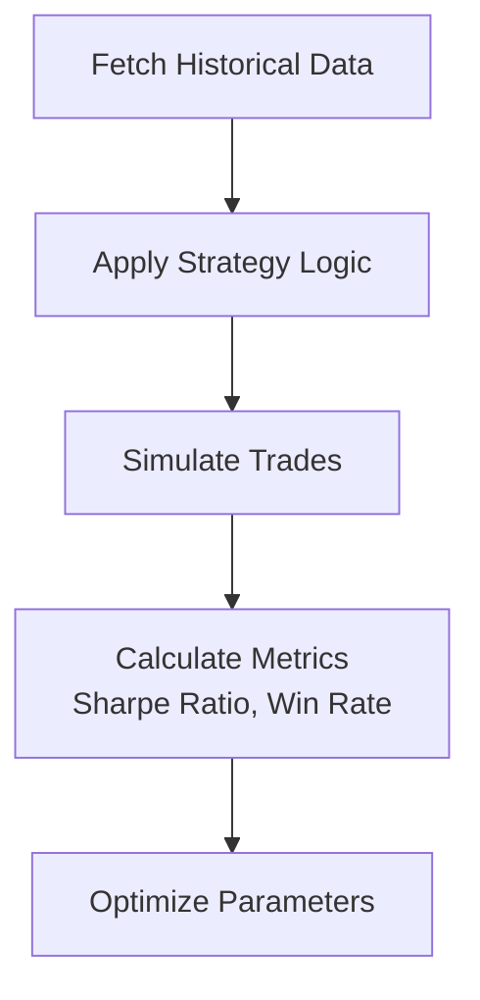

## Overview

SystemForge equips you with powerful tools for cryptocurrency trading. You implement algorithmic strategies, leverage the proprietary SF Matrix algorithm, create custom indicators, and backtest with historical data spanning over 20,000 trades since 2023. These features enable precise market analysis and automated execution.

<Columns cols={2}>
  <Card title="Algorithmic Trading" icon="zap" href="#implementing-algorithmic-trading-strategies">
    Automate trades with customizable strategies.
  </Card>
  <Card title="SF Matrix" icon="trending-up" href="#sf-matrix-algorithm">
    Proprietary algorithm for market prediction.
  </Card>
  <Card title="Custom Indicators" icon="bar-chart-3" href="#custom-indicators">
    Build tailored analysis tools.
  </Card>
  <Card title="Backtesting" icon="play" href="#backtesting-strategies">
    Validate strategies on historical data.
  </Card>
</Columns>

## Implementing Algorithmic Trading Strategies

You start by defining your strategy logic, connecting to exchanges, and executing trades via the SystemForge API. Follow these steps to deploy a simple moving average crossover strategy.

<Steps>
  <Step title="Connect to Exchange" icon="link">
    Use the API to authenticate and fetch market data.

````python
import ccxt
import requests

exchange = ccxt.binance({
    'apiKey': 'YOUR_API_KEY',
    'secret': 'YOUR_SECRET',
})

symbol = 'BTC/USDT'
ohlcv = exchange.fetch_ohlcv(symbol, timeframe='1h')
````

  </Step>
  <Step title="Define Strategy Logic" icon="code">
    Implement crossover detection.

````python
def moving_average_crossover(prices, short_window=10, long_window=30):
    short_ma = prices.rolling(window=short_window).mean()
    long_ma = prices.rolling(window=long_window).mean()
    return short_ma > long_ma
````

  </Step>
  <Step title="Execute Trades" icon="shopping-bag">
    Place buy/sell orders based on signals.

````python
if crossover_signal:
    exchange.create_market_buy_order(symbol, amount=0.001)
````

  </Step>
</Steps>

<Callout kind="tip">
  Monitor positions in real-time via the dashboard at `https://dashboard.example.com/positions`.
</Callout>

## SF Matrix Algorithm

The SF Matrix algorithm processes multi-dimensional market data to generate buy/sell signals. You integrate it into your strategies for enhanced predictions.

<Tabs>
  <Tab title="BTC/USDT" icon="dollar-sign">
    Fetch SF Matrix scores.

````javascript
const response = await fetch('https://api.example.com/v1/sf-matrix/BTCUSDT', {
  headers: { 'Authorization': 'Bearer YOUR_TOKEN' }
});
const scores = await response.json();
console.log(scores.signal); // 'buy', 'sell', or 'hold'
````

  </Tab>
  <Tab title="ETH/USDT" icon="activity">
    Similar integration for Ethereum.

````javascript
const response = await fetch('https://api.example.com/v1/sf-matrix/ETHUSDT', {
  headers: { 'Authorization': 'Bearer YOUR_TOKEN' }
});
// Process scores.signal
````

  </Tab>
</Tabs>

## Custom Indicators and Market Analysis Tools

You create indicators like RSI or MACD using historical data. Combine them with SF Matrix for robust analysis.

<CodeGroup tabs="Python,JavaScript">
```python
import pandas as pd
import talib

def compute_rsi(prices, period=14):
    return talib.RSI(prices, timeperiod=period)
```
```javascript
// Using TA-Lib wrapper
const rsi = talib.execute({
  name: "RSI",
  startIdx: 0,
  endIdx: prices.length - 1,
  inReal: prices
});
```
</CodeGroup>

<Expandable title="Advanced Custom Indicator Example" default-open="false">
  Build a volatility-adjusted indicator.

````python
def volatility_adjusted_ma(prices, volatility_period=20):
    vol = prices.pct_change().rolling(volatility_period).std()
    return prices.rolling(20).mean() / vol
````

</Expandable>

## Backtesting Strategies

Validate your strategies against historical data to assess performance.



<Callout kind="info">
  Backtest over at least 1 year of data for reliable results. Access endpoints at `https://api.example.com/v1/backtest`.
</Callout>

<ParamField path="strategy" param-type="string" required="true">
  Your strategy definition as JSON.
</ParamField>

<ParamField query="start_date" param-type="string" required="false">
  Backtest start date (YYYY-MM-DD).
</ParamField>

You gain confidence in live deployment by reviewing metrics like profit factor and maximum drawdown. Start with these core features to build profitable trading systems.