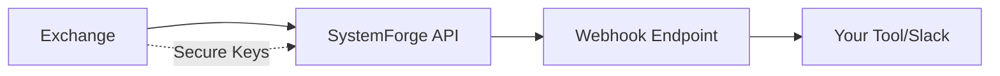

## Overview

SystemForge supports seamless integrations with major cryptocurrency exchanges, wallets, and external tools. You link your accounts to automate trades, receive real-time notifications via webhooks, and access our API for custom strategies powered by the SF Matrix algorithm. These connections enable over 20,000 trades since 2023 with enhanced security.

<Callout kind="info">
  Review your exchange's terms before connecting API keys to ensure compliance.
</Callout>

## Supported Exchanges

Connect to popular platforms for live trading data and order execution.

<Columns cols={2}>
  <Card title="Binance" icon="activity" href="https://binance.com">
    Spot, futures, and margin trading with high liquidity for BTC/USDT and 500+ pairs.
  </Card>
  <Card title="Coinbase" icon="dollar-sign" href="https://coinbase.com">
    Secure USD pairs and advanced trading for institutional-grade execution.
  </Card>
</Columns>

## Linking Exchanges

Follow these steps to connect an exchange account.

<Steps>
  <Step title="Generate API Keys" icon="key">
    Log into your exchange dashboard. Create a new API key with read/write permissions for trading.
  </Step>
  <Step title="Add to SystemForge" icon="settings">
    Navigate to your SystemForge dashboard at `https://dashboard.example.com/integrations`. Paste the API key, secret, and passphrase.
  </Step>
  <Step title="Verify Connection" icon="check-circle">
    Test the connection. SystemForge pings the exchange with a small query to confirm access.
  </Step>
</Steps>

## Webhook Setup

Configure webhooks to receive automated trade notifications.

<Tabs>
  <Tab title="Generic Webhook" icon="link">
    Set your webhook URL to `https://your-webhook-url.com/systemforge`.

````json
{
  "event": "trade_executed",
  "symbol": "BTC/USDT",
  "side": "buy",
  "price": 65000.50,
  "quantity": 0.01
}
````
  </Tab>
  <Tab title="Slack Integration" icon="message-circle">
    Use this endpoint format for Slack.

````bash
curl -X POST https://hooks.slack.com/services/YOUR/SLACK/WEBHOOK \
  -H "Content-type: application/json" \
  -d '{"text": "SystemForge Trade: BTC/USDT bought at $65,000"}'
````
  </Tab>
</Tabs>

## API Access

Build custom strategies using our REST API at `https://api.example.com/v1`.

<ParamField path="symbol" param-type="string" required="true">
  Trading pair, e.g., `BTC/USDT`.
</ParamField>

<ParamField header="Authorization" param-type="string" required="true">
  Bearer `{YOUR_API_KEY}`.
</ParamField>

<Request tabs="JavaScript,cURL">
  ````javascript
  const response = await fetch('https://api.example.com/v1/strategies/sf-matrix', {
    method: 'POST',
    headers: {
      'Authorization': 'Bearer YOUR_API_KEY',
      'Content-Type': 'application/json'
    },
    body: JSON.stringify({
      symbol: 'BTC/USDT',
      timeframe: '1h'
    })
  });
  ````

  ````bash
  curl -X POST https://api.example.com/v1/strategies/sf-matrix \
    -H "Authorization: Bearer YOUR_API_KEY" \
    -H "Content-Type: application/json" \
    -d '{
      "symbol": "BTC/USDT",
      "timeframe": "1h"
    }'
  ````
</Request>

<Response tabs="200">
  ````json
  {
    "signal": "buy",
    "confidence": 0.85,
    "sf_matrix_score": 78,
    "price_target": 67000
  }
  ````
</Response>

<CodeGroup tabs="Python,JavaScript">
  ```python
  import requests

  url = "https://api.example.com/v1/trades"
  headers = {"Authorization": "Bearer YOUR_API_KEY"}
  response = requests.get(url, headers=headers)
  print(response.json())
  ```
  ```javascript
  const fetchTrades = async () => {
    const res = await fetch('https://api.example.com/v1/trades', {
      headers: { Authorization: 'Bearer YOUR_API_KEY' }
    });
    return res.json();
  };
  ```
</CodeGroup>

## Security Best Practices

Protect your integrations from unauthorized access.

<Expandable title="API Key Management" default-open="true">
  Rotate keys every 90 days. Use IP whitelisting on exchanges. Never expose secrets in client-side code.
</Expandable>

<Callout kind="alert">
  Enable 2FA on all connected accounts. Monitor logs at `https://dashboard.example.com/logs` for suspicious activity.
</Callout>



These integrations streamline your workflow while maintaining enterprise-grade security.