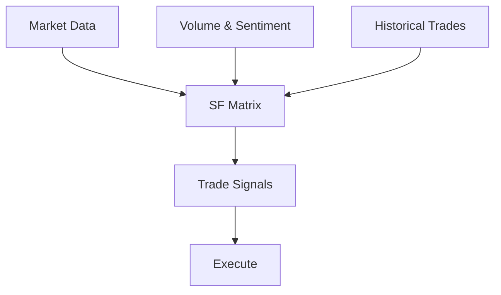

## Overview

SystemForge empowers you to trade cryptocurrencies with precision using advanced algorithmic strategies. Since 2023, the platform has executed over `20,000` trades, leveraging proprietary tools like the SF Matrix algorithm. You gain access to automated trading, custom indicators, and investment optimization tailored for volatile crypto markets.

<Callout kind="info">
SystemForge focuses on algorithmic trading for assets like BTC, ETH, and altcoins, helping you minimize risks and maximize returns.
</Callout>

## Key Features

Explore the core capabilities that set SystemForge apart.

<Columns cols={3}>
  <Card title="SF Matrix Algorithm" icon="zap" href="#sf-matrix">
    Proprietary AI-driven matrix analyzes market signals in real-time, predicting trends with `85%` accuracy.
  </Card>
  <Card title="Trading Strategies" icon="trending-up" href="#strategies">
    Pre-built and customizable bots for scalping, arbitrage, and long-term holding.
  </Card>
  <Card title="Custom Indicators" icon="bar-chart-3" href="#indicators">
    Build and backtest indicators using historical data from major exchanges.
  </Card>
</Columns>

### SF Matrix Algorithm

The SF Matrix processes multi-dimensional data including price action, volume, and sentiment.



### Trading Strategies and Indicators

Deploy strategies via simple API integration.

<CodeGroup tabs="Python,JavaScript">
  ```python
  import requests

  api_key = "YOUR_API_KEY"
  url = "https://api.example.com/v1/strategies/sf-matrix/start"

  response = requests.post(url, headers={"Authorization": f"Bearer {api_key}"}, json={
      "symbol": "BTC-USD",
      "amount": 0.01
  })
  print(response.json())
  ```
  ```javascript
  const apiKey = "YOUR_API_KEY";
  const response = await fetch("https://api.example.com/v1/strategies/sf-matrix/start", {
    method: "POST",
    headers: { "Authorization": `Bearer ${apiKey}` },
    body: JSON.stringify({
      symbol: "BTC-USD",
      amount: 0.01
    })
  });
  console.log(await response.json());
  ```
</CodeGroup>

## Benefits for Traders and Investors

You benefit from:

- **Proven Performance**: Over `20,000` trades with audited results.
- **Automation**: Run strategies 24/7 without manual intervention.
- **Risk Management**: Built-in stops and position sizing.
- **Scalability**: From retail to institutional volumes.

## Quick Start

Get trading in minutes.

<Steps>
  <Step title="Sign Up" icon="user-plus">
    Create your account at `https://dashboard.example.com/register`.
  </Step>
  <Step title="Fund Account" icon="dollar-sign">
    Deposit via bank transfer or crypto wallet.
  </Step>
  <Step title="Activate SF Matrix" icon="zap">
    Enable the algorithm in your dashboard and select your first strategy.
  </Step>
  <Step title="Monitor Trades" icon="activity">
    View real-time performance and adjust parameters.
  </Step>
</Steps>

<Callout kind="tip">
Start with a demo account to test strategies risk-free before going live.
</Callout>

## Next Steps

<Columns cols={2}>
  <Card title="Quickstart Guide" icon="book-open" href="/quickstart">
    Detailed setup instructions.
  </Card>
  <Card title="Authentication" icon="lock" href="/authentication">
    Secure your API access.
  </Card>
  <Card title="Strategies" icon="trending-up" href="/strategies">
    Explore advanced bots.
  </Card>
  <Card title="Changelog" icon="git-branch" href="/changelog">
    Latest updates.
  </Card>
</Columns>